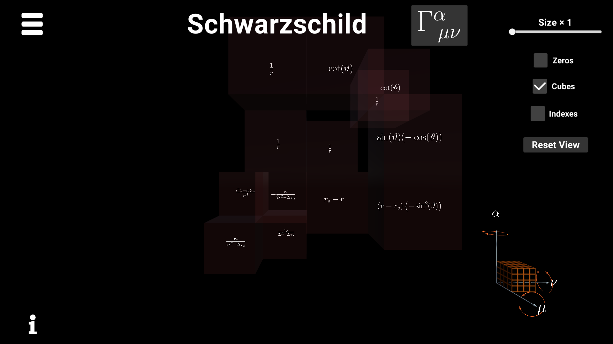
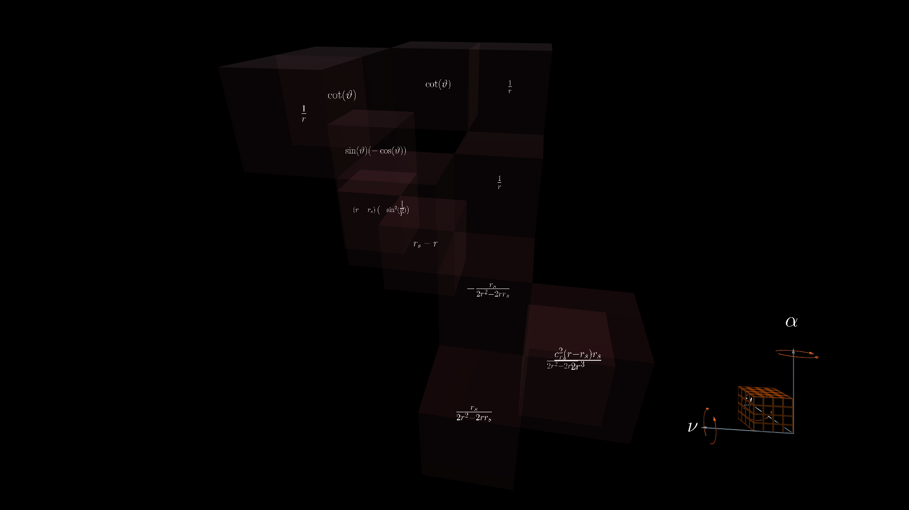
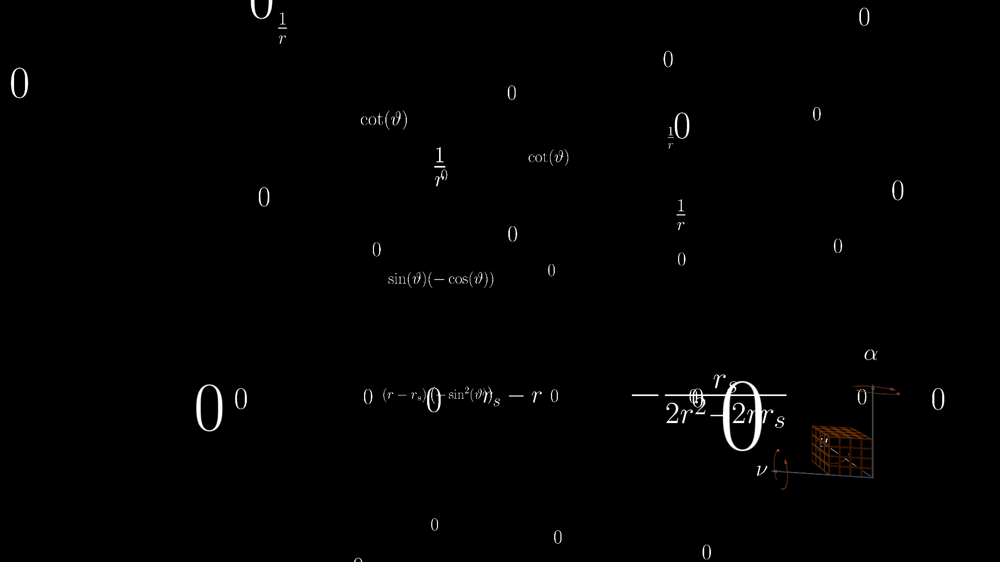

# Christoffel Symbols Visualization

**Christoffel Symbols Visualtization** is an application made to visualize [Christoffel connection](https://en.wikipedia.org/wiki/Christoffel_symbols). The project is an element of my bachelor's thesis [*Symbolic visualizations of the Christoffel connection utilizing the Unity engine*](./thesis.pdf) (written in polish). Project was developed using Unity (with C# of course) but also using LaTeX and Mathematica (to display and genereate mathematical formulas of different connections).

## How to run
In order to run this project open it with Unity 2019.4.4f1 or higher. After that open scene named MainScene.

## Screenshots

